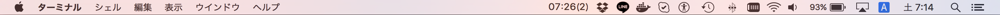

# bitbar_plugins

Some <a href="https://github.com/matryer/bitbar">Bitbar</a> plugins.

- mcupdate.rb : Show minecraft server time and current number of players in MacOS menu bar.
Set "enabled" directory as BitBar plugin directory.

